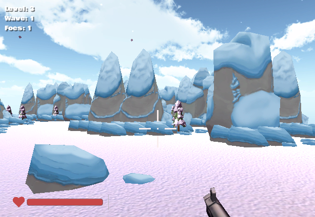

## “Not In Kansas Anymore” Unity Game
It's a strange title for a game but simply put its a survival shooter game with some interesting tweaks.

## procedural generated world
I was tasked with creating the terrain of the game but I didn't want to manually place all
the elements. Instead I used some procedural generated script to randomly 
spawn the 2D space and then use the terrain toolkit to add the additional features. 

## example screenshots

