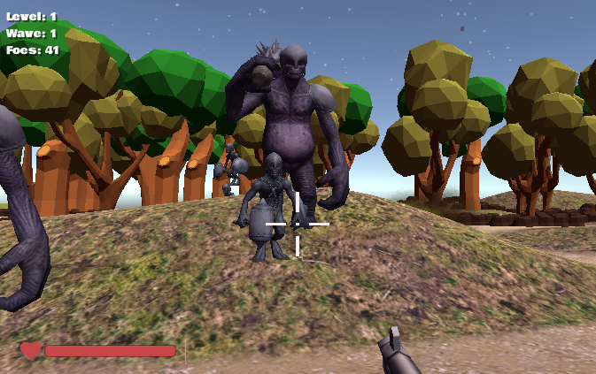

[notkansas]: https://chewie-lin.me/notkansas "not in kansas game"

## “Not In Kansas Anymore” Unity Game
It's a strange title for a game but simply put its a survival shooter game with some interesting tweaks.

## procedural generated world
I was tasked with creating the terrain of the game but I didn't want to manually place all
the elements. Instead I used some procedural generated script to randomly 
spawn the 2D space and then use the terrain toolkit to add the additional features. 

This game's environment is auto generated at run time using map generator and mesh generator. By using the runtime navmesh APIs from Unity, the AI agent now navigate the new space without manual baking.

You can try the game here at [notkansas].

## example screenshots

